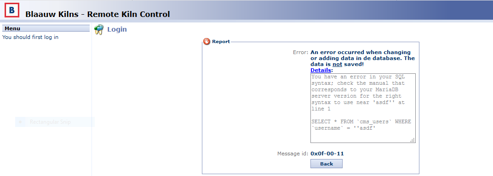

# An Unfortunate “Kilnundrum”
***Multiple vulnerabilities in Blaauw Kilns Remote Kiln Control leading to RCE and subsequent ghosting by the vendor***

This is the story of a couple of vulnerabilities I discovered in a kiln during a network vulnerability assessment, and how I have no idea whether or not they are currently patched. I went back and forth as to whether or not to release this information for a while, but since I made multiple good-faith efforts to work with the vendor to resolve the issues, I have decided to release the information so that people will at least know that their products may be vulnerable. The vulnerabilities discovered can lead to remote code execution, so it is important to know whether or not you may be affected.

## SQL Injection to grab MD5 password Hashes
During a network vulnerability assessment for a client, I was looking at the results of some Nessus scans. One instance of SQLi immediately seemed like a false positive, but regardless I always double check just in case it wasn’t. After checking out the URL reported to have an SQLi, it was in fact a false positive, but the web application was a PHP app so I decided to poke around anyways. There was a login screen, and as it turned out, the username in the login screen itself was vulnerable to SQL injection.

*Fig 1: A SQL injection triggered via the username field in the login page.*

Using this SQLi I was able to dump the contents of the database using sqlmap and was able to identify three databases:

-	Information_schema
-	rkc
-	test

Based on the title of the web application, we can assume rkc stands for “Remote Kiln Control”. After listing the tables I was able to identify a table called `cms_users`. Dumping this table revealed a list of username and password hashes. The password hashes were simply md5 hashes of the passwords, and it was trivial to crack the hashes and gain administrative access to the remote kiln control interface.

## Authenticated Arbitrary File Download
Once authenticated I begin to poke around to see if there were any vectors for remote code execution. The first notable was an arbitrary file download through a file called `excel.php`. Using a specially crafted iniFile parameter, I was able to download the source code for the application.

**Example:** `/excel.php?iniFile=../../../../../../../xampp/htdocs/debug.php&modeBinary=1`

## Authenticated Arbitrary File Upload
The `debug.php` file already allows a user to execute arbitrary php code in a web UI, so we technically already have RCE. The `debug.php` file also contains a file upload location that allowed me to upload a PHP webshell.

## Other vulnerabilities
All in all, I distilled my findings into 9 distinct vulnerabilities and generated a report to send to the vendor. In total the findings included:

1.	Information Exposure through Discrepancy
2.	Information Exposure through Source Code
3.	Information Exposure through Directory Listing
4.	Information Exposure
5.	SQL Injection
6.	Weak Password Requirements
7.	Arbitrary File Download
8.	Arbitrary File Upload
9.	Leftover Debug Code

I was able to identify a few version numbers attributed to the instance of the Remote Kiln Control. They are as follows.

-	Remote Kiln Control
-	RKC - version: v3.00r4
-	SVN revision: 278

## Vendor Contact
I originally contacted the Vendor on November 6, 2019, with a report outlining all of the above vulnerabilities. They responded timely, and told me they had already received my report, CC’ing an unrelated institution who had also submitted a vulnerability report to them. I informed Blauuw Kilns that was not in fact my client and that my report may contain different vulnerabilities than had already been reported. (There were other vulnerabilities related to dependencies that were being addressed separately). They asked who my client was, and I responded I couldn’t give out my client information but I would be happy to give their information to my client. After that email I was ghosted.

I sent a follow up email on December 11, 2019, indicating I had reported the vulnerabilities to MITRE and planned a release date of January 24, 2020. I also tried to communicate through them via my client, but to no avail. Now at least 3 months after the date I intended to release the CVEs I think there has been adequate time to fix the bug so I am publishing the details. I am hoping that they fixed the bug but just decided to not talk to me.

## CVE List
**Information Exposure Through Discrepancy (CVE-2019-18865)**

Information disclosure via error message discrepancies in authentication functions in Blaauw Remote Kiln Control through v3.00r4 allows an unauthenticated attacker to enumerate valid usernames.

**Information Exposure through source code (CVE-2019-18868)**

Blaauw Remote Kiln Control through v3.00r4 allows an unauthenticated attacker to access MySQL credentials in cleartext in `/engine/db.inc`, `/lang/nl.bak`, or `/lang/en.bak`

**Information Exposure Through Directory Listing (CVE-2019-18867)**

Browsable directories in Blaauw Remote Kiln Control through v3.00r4 allow an attacker to enumerate sensitive filenames and locations, including source code.
 This affects `/ajax/`, `/common/`, `/engine/`, `/flash/`, `/images/`, `/Images/`, `/jscripts/`, `/lang/`, `/layout/`, `/programs/`, and `/sms/`.

**Information Exposure (CVE-2019-18864)**

Kiln Control through v3.00r4 allows an unauthenticated attacker to gain sensitive information about the host machine via `/server-info` and `/server-status` endpoints.

**SQL Injection (CVE-2019-18866)**

Unauthenticated SQL injection via the username in the login mechanism in Blaauw Remote Kiln Control through v3.00r4 allows a user to extract arbitrary data from the rkc database.

**Weak Password Requirements (CVE-2019-18872)**

Weak password requirements in Blaauw Remote Kiln Control through v3.00r4 allow a user to set short or guessable passwords (e.g., 1 or 1234).

**Arbitrary File Download (CVE-2019-18870**

A path traversal via the `iniFile` parameter in `excel.php` in Blaauw Remote Kiln Control through v3.00r4 allows an authenticated attacker to download arbitrary files from the host machine.

**Arbitrary File Upload (CVE-2019-18871)**

A path traversal in `debug.php` accessed via `default.php` in Blaauw Remote Kiln Control through v3.00r4 allows an authenticated attacker to upload arbitrary files, leading to arbitrary remote code execution.

**Leftover Debug Code (CVE-2019-18869)**

Leftover Debug Code in Blaauw Remote Kiln Control through v3.00r4 allows a user to execute arbitrary PHP code via `/default.php?idx=17`
